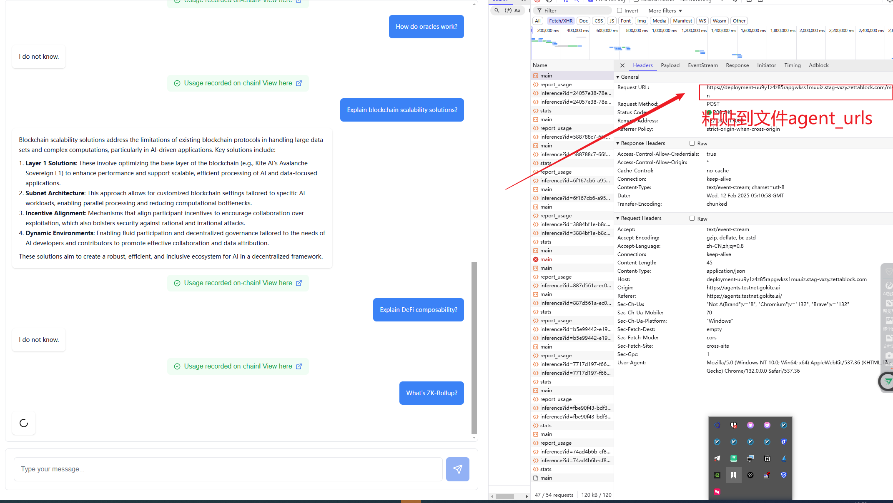

# ILSH KITE v1.0 - AI 交互脚本
## 注意事项

⚠️ 重要安全提示：
1. 代理配置需使用可靠的服务商
2. 钱包信息请妥善保管
3. 建议在隔离环境运行脚本

## 社区支持

💬 空投信息、脚本频道：[Telegram频道](https://t.me/ilsh_auto)
🐦 最新更新：[X官方账号](https://x.com/hashlmBrian)
🚀 AI交互自动化工具

## 功能特点

- 异步AI交互处理
- 多代理URL轮换支持
- 智能代理配置管理
- 钱包地址集成与验证
- 流式响应实时处理

## 安装说明
先启动JS、再启动Python

### python部分
用于kite交互
1. 安装依赖包：
pip install -r requirements.txt
2. 创建 `agen_urls` 文件：

3. 创建acc文件：
写入助记词、socks5代理，
格式：xxxx xxxx xxxx ... ---- socks5://127.0.0.1:1000
4. 启动
 python kiteai.py
### js部分
用于生成钱包签名，使用webstorm或者命令行启动
复制js_server中的js文件
1. 初始化
    mkdir js_server && cd js_server
    npm init -y
2. 安装依赖
   npm install express@4.18.2 body-parser@1.20.2 ethers@6.7.1 socks-proxy-agent@8.0.2 dotenv@16.3.1
3. 启动服务
   webstorm直接启动即可。
   命令行：
   npm run dev

# 出现问题请先使用deepseek\chatgpt询问

## 支持开发

☕ 如果您觉得这个工具有帮助，可以通过发送 USDT 来支持开发:

- 网络: TRC20
- 地址: `TAiGnbo2isJYvPmNuJ4t5kAyvZPvAmBLch`
- 

## 免责声明

本工具仅供学习研究区块链交互技术之用，使用者应自行承担因不当使用导致的各类风险。开发团队不对任何资产损失负责。
